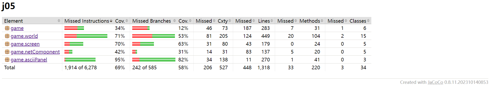

# 文档说明

### j05 - 并发
#### 游戏中的并发对象介绍
- 玩家
    - 每名玩家拥有一个独立的线程，通过定时调度来实时更新它的状态，包括改变受攻击状态下的任务图标、判断是否处于被污染的格子上、更新 hp 值
- Boss
    - 每个 boss 拥有一个独立的线程来实现该生物的自主决策，包括自主移动和对玩家发起攻击
    - 我在设计 boss 的机制时，参考了 minimax 算法中实时搜索最优解的思想，bossAI 每次更新时会根据玩家当前的位置，通过最短路算法计算离玩家最近的相邻格子，然后移动到这个格子上，以此实现逐步向玩家靠近的逻辑
    - 为了让 boss 的移动轨迹更合理，尽量少紧贴地图边界，在决策算法中，我为不同位置的格子赋予不同权值，使得 boss 在移动时会优先选择四周为空的格子
    - 若玩家长期处于同一个位置不移动，boss 会在玩家的四周召唤狗狗陷阱，若玩家接触陷阱就会受到伤害。实现原理是，bossAI 每隔若干时间段会获取玩家的位置，然后等待 $\delta$ 时间后向这个位置召唤陷阱
- 实现细节
    - 在 `CreatureFactory` 中维护一个线程池 `ScheduledThreadPoolExecutor`，每个并发对象创建时向线程池中提交定时任务，线程池会每隔固定时间调度任务执行，进而执行对应生物的 `onUpdate()` 方法
    - 游戏世界除了在接受玩家输入时会更新外，也有一个独立的线程定时执行游戏世界的更新，并绘制游戏界面
    - 由于生物死亡后，它的更新线程还在被线程池所调度，因此在每个生物的独立线程创建时，会将 `scheduleAtFixedRate()` 返回的 `ScheduledFuture` 对象保存在 `CreatureAI` 中，当生物被移除时，会调用 `ScheduledFuture.cancel()` 方法使线程不再被调度执行
#### 其它游戏生物介绍
- `BeanAI`
    - 豆子类，随机分布和生成，玩家接触到可以回复 hp 值
- `BulletAI`
    - 猫猫子弹类，玩家可以通过 `W`、`A`、`S`、`D` 来朝四个方向发射猫猫子弹，子弹接触到敌方生物时会攻击
- `DogAI`
    - 狗狗陷阱类，当它检测到四周存在玩家时，它会一直存在；否则，就会自动消失
#### 并发控制
- 互斥对象
    - `Tile` 类型：每个时刻，同一个格子上只能存在一个生物体。在 `World` 类中为每个格子维护一个 `AtomicBoolean` 变量 `occupied`，标记某个格子是否被生物体所占据，对每个 `occupied` 的修改是保证原子性和互斥性的
    - `List<Creature> creatures` 对象：两个线程不能同时对 List 做修改，否则会抛出 `ConcurrentModificationException` 异常，而且会破坏程序执行的正确性。因此，设置一个 `ReentrantLock` 锁来实现互斥，每个线程想要访问 `creatures` 前必须加锁，访问完后解锁
    - 每个 `Creature` 的 hp 值等属性属于线程共享变量，需要互斥控制，实现方法是把共享变量的 `modify()` 方法用 `synchronized` 关键字标记。保证对一个生物体的并发攻击是串行调用 `modifyHp()` 方法的
### j06 - 构建
#### maven 管理
- 使用 maven-3.9.5 进行项目管理
- 项目依赖项有 `junit` 和 `mockito`
- 使用 `jacoco` 插件生成代码覆盖率报告
- 使用 `maven-shade` 插件对项目进行编译和打包
#### 自动构建
自动构建的步骤为
- 先切换到当前分支
- 建立 java 环境，这里使用的是 `oracle` 的版本
- 在 `cache` 中缓存 maven 文件
- 最后用 `mvn -B clean package --file pom.xml` 命令构建 maven 项目
### j07 - 测试
- 使用 `junit` 进行单元测试
- 使用 `Coverage Gutters` 插件展示覆盖率
- 使用 `jacoco` 插件生成覆盖率报告
- 主要的测试覆盖范围为 `asciiPanel`、`world` 和 `screen` 模块，通过创建新的对象并调用对象的方法，综合使用了 `assertEquals`、`assertNotNull` 和 `expected` + 异常等手段进行测试
- 某些方法的输入难以直接创建，如 `KeyEvent` 事件、`SelectionKey` 对象等，采用 `mockito` 插件来模拟输入
- 项目的代码覆盖率为 `68%`，其中主要覆盖范围的覆盖率达到 `70%`。由于 `game` 和 `netComponent` 模块中包含网络通信、监听和处理玩家键盘输入的逻辑，较难在单元测试中覆盖，因此覆盖率较低。完整的代码覆盖率截图如下

- 完整的报告保存在 `jacoco\` 目录下
### j08 - IO
#### 地图保存/加载
实现思路是把地图的地形映射到一个数字，然后整张地图就可以编码到文本文件中，保存在 maven 项目的 `resources/` 目录下。在加载游戏时，通过 `getClass().getClassLoader().getResourceAsStream()` 方法把资源文件作为输入流，然后通过 `BufferedReader` 来读入地图，实现地图加载和自动构建
#### 进度保存/恢复
想法是把游戏进行时每个时刻的状态保存下来，之后就可以根据状态序列重构游戏世界。为所有游戏状态中包含的类实现 `Serializable` 接口，就可以通过 `ObjectOutputStream` 和 `ByteArrayOutputStream` 把游戏状态序列化为字节数组，最后用 `BufferedOutputStream` 写入文件中保存。实现上，在 `ApplicationMain` 中为玩家提供了“读取进度并恢复”的功能，游戏会自动读取记录文件，重放游戏过程，重放完成后会在终端打印 `Ready to go`，玩家可以在上一次进度的基础上接着游戏

由于 `Screen` 中存在不可序列化的对象，而且并发生物体的线程无法在进度中保存，因此添加一个 `synchronize()` 方法，用于回放完成后初始化这些对象和线程，就可以实现无缝衔接
#### 游戏过程录制/回放
因为每次调用 `repaint()` 函数会执行游戏世界的更新，因此可以在负责游戏更新的线程每次调用 `repaint()` 之后，把当前的游戏状态序列化并输出到记录文件中保存。实现上，为玩家提供了“在录制模式下游戏”的功能，在该模式下游戏，会自动录制游戏过程。在 `ApplicationMain` 类中维护一个变量 `recordCnt`，用于标识记录文件编号，每次记录游戏状态时，会把序列化后的对象输出到一个新的文件中，文件名为当前记录的编号值，录制文件保存在 `record\` 目录下。回放功能如上所述
### j09 - 网络通信
在 NIO Selector 的基础上，实现了 Reactor 来管理网络通信
- `ReactorManager` 类用于封装 Reactor 的启动过程，包括开启 `ServerSocketChannel` 和注册各事件的 `EventHandler`
- `Reactor` 类是管理 NIO Selector 的主类，内部维护分派器 `Selector demultiplexer`，在 `run()` 函数中主循环每轮从分派器中选择可用的 SelectionKey，并交付给对应的 EventHandler 处理
    - `Reactor` 中维护了一个集合 `List<SelectionKey>`，当玩家向服务器发起连接时，这条 channel 的 SelectionKey 会被 Reactor 所记录，并赋予一个 ID，用于标识玩家身份
    - `Reactor` 中还提供了 `reply()` 方法和 `parseData()` 方法，前者用于把当前游戏世界的内容发送给特定的玩家，在这里会用到该玩家所对应的 SelectionKey；后者用于解析用户向 Reactor 发送的数据，玩家发送的数据会在这里被解析为对应的键盘事件，并传给服务器进行响应
- `EventHandler` 是一个协议，不同类型的 EventHandler 都需要实现 `handleEvent()` 方法
    - `AcceptEventHandler` 处理玩家向服务器发起的连接，在这里记录玩家的 SelectionKey 并赋予 ID
    - `ReadEventHandler` 处理读事件。当 Reactor 在读取 channel 的buffer 时，如果此时玩家断开连接，那么 `read()` 函数会抛出 `SocketException`，ReadEventHandler 捕捉到这个异常后会关闭 socketChannel
    - `WriteEventHandler` 处理写事件

`Server` 的设计
- 作为服务器，Server 中应该维护不同类型的 `Screen` 实例，同时负责各个 screen 的更新
- 每个玩家所处的状态各有不同，但是状态之间转换的规则是相同的，因此可以用有限状态机对玩家状态进行建模
    - 设 $DFA=\lbrace Q, \Sigma, \delta, q_0, F \rbrace$
    - $Q$：由于每个 screen 都可以代表一种状态，因此把 `StartScreen`、`WinScreen`、`LoseScreen` 和 `SnakeGameScreen` 分别编号为 0、1、2、3，作为状态集合，因此 $Q=\lbrace 0,1,2,3\rbrace$
    - $\Sigma$：由于每个 screen 在接收键盘事件后发生状态的改变，因此输入集合就是键盘事件
    - $q_0$：每个玩家初始时都处于 `StartScreen` 中，因此 $q_0=0$
    - $F$：可以认为 `WinScreen` 是可被接收的状态，因此 $F=\lbrace 3\rbrace$
    - $\delta$：直接根据 `Screen` 的 `respondToUserInput()` 方法返回值的 `Screen` 类型判断属于哪个状态即可，即假设映射函数为 $f$，输入 $a\in \Sigma$，当前状态为 $s$，那么 $\delta(s,a)=f(f^{-1}(s).respondToUserInput(a))$，其中 $f^{-1}$ 把当前状态映射到对应的 `Screen` 对象中
- 在 `Server` 中维护映射 `HashMap<Integer, Integer> states`，用于记录每个玩家的状态，Server 接收到来自 Reactor 的键盘事件输入后，首先获取这次事件对应的玩家 ID，实现上可以通过 `SelectionKey.attachment()` 来获得，然后传入 DFA 中调用 `respondToUserInput()` ，完成对键盘事件的响应并更新状态
- 在 `Server` 调用 `repaint()` 方法更新 screen 对象时，会同时向各个玩家发送它们各自的 screen，实现上是遍历 Reactor 的 SelectionKey 集合，取得每个 key 对应 ID 的状态，然后把对应 screen 信息序列化并写到 channel 的 buffer 中

`Client` 的设计
- 作为客户端，Client 首先需要记录自己的玩家 ID。Client 向 Server 注册时，Server 会为该玩家分配一个 ID，然后会写到这条 channel 的 buffer 中，Client 在首次读取 buffer 的数据时，会读取到这个 ID 并保存
- 为了方便 Client 读取 Server 发送的信息，同时在读取键盘输入时及时向 Server 发送键盘事件，为 Client 开启了一个 Selector，主循环中如果获取到读事件，就会通过 `ObjectInputStream` 和 `ByteArrayInputStream` 读取 buffer 并转换为 `Screen` 对象，然后调用 `repaint()` 进行绘制
- 在检测到键盘事件时，会将键盘事件的 KeyCode 编码并写到 buffer 中，就能将玩家事件同步到 Server 中

`SnakeGameScreen` 的支持
- 为了支持多玩家，在 `SnakeGameScreen` 中添加 `registerSnake()` 方法，同时修改 `snake` 对象为 `HashMap<Integer, Creature>` 对象，目的是记录每个 ID 对应的生物的状态
- 修改 `respondToUserInput()` 方法，增加 `id` 参数，实现对于特定玩家状态的修改